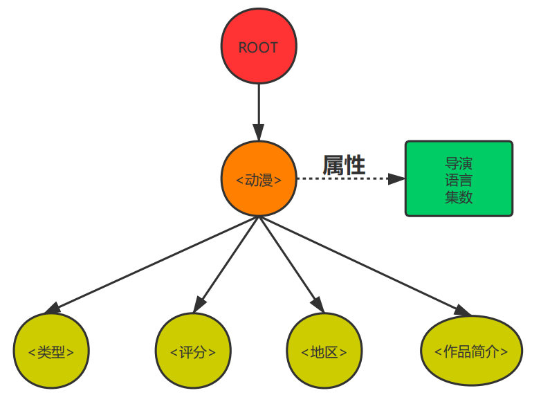

 

## 小组信息

| 组名 | default组（4组） |
| ---- | ---------------- |
| 组长 | 郑浩             |
| 组员 | 赵谦，商一帆     |
| 主题 | 动漫             |

## 信息模型

# 更新日志

### [3-28]第四次作业

> 本次分工： 小组成员海报(郑浩)  数据采集(商一帆)  动漫主页(赵谦)  动漫海报(三人每人一个)

* 小组成员海报: [链接](http://118.25.136.129:7788/peoples/peoples.xml);
* 郑浩的动漫海报: [链接](http://118.25.136.129:7788/huoying/huoying.xml);
* 赵谦的动漫海报:[链接](http://118.25.136.129:7788/work4/JOJO海报-赵谦/poster.xml);
* 商一帆的动漫海报:[链接](http://118.25.136.129:7788/work4/%E7%8C%AB%E5%92%8C%E8%80%81%E9%BC%A0-%E5%95%86%E4%B8%80%E5%B8%86/cartoons.xml);
* 小组35个动漫的主页[链接](http://118.25.136.129:7788/work4/cartoons.xml);

### [3-18]第三次作业

> 本次分工：
>
>  CSS：郑浩  
>
> schema ：赵谦  
>
> PPT 商一帆

* 完整的数据：[链接](./3-18第三次作业/cartoons.xml)
* 验证xml的schema：[链接](./3-18第三次作业/schame.xml)
* 对应的css文件: [链接](./3-18第三次作业/cartoon.css)
* 最终渲染的效果:[网页链接](http://118.25.136.129:7788/) 

预览图如下：

### [3-11]第二次作业

* 新的信息模型
* 信息模型DTD ：[链接](./3-11第二次作业/DTD.xml)
* 15条动漫记录 [链接](./3-11第二次作业/cartoons.xml)：
* 分工：信息模型设计(郑浩)、信息模型修正（商一帆、赵谦）、DTD编写（郑浩）、数据采集（商一帆、赵谦、郑浩）。

### [3-4]第一次作业

* 18条动漫记录：[链接](./3-4第一次作业/homework1.xml)

### [2-28]-个人明信片

* 郑浩的明星片：[链接](./2-28小组明信片/zhenghao.xml);

* 商一帆的明星片：[链接](./2-28小组明信片/shangyifan.xml);

* 赵谦的明星片：[链接]();

  

